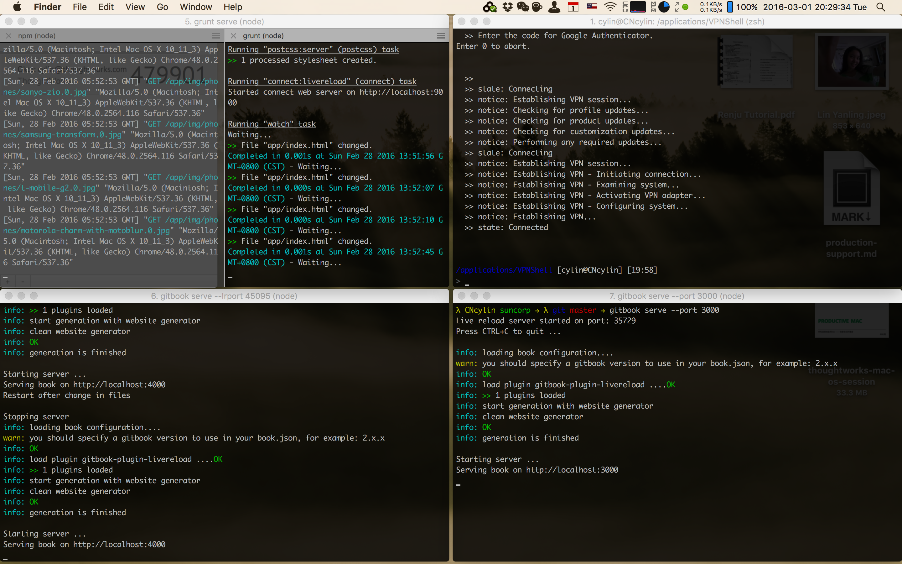

# iTerm2

## 实用特性 Handy Features

这里的参考：[https://www.iterm2.com/features.html](https://www.iterm2.com/features.html)

iTerm这个终端具有比系统默认终端更强的能力，而term3则是最近刚发布的beta版本。它比起系统默认终端具备更加丰富且实用的功能，比如：
* 窗口切分(Split Panes)
* 即时窗口(Hotkey Window)
* 搜索，支持正则表达式
* 全键盘复制(Mouseless Copy)。在搜索窗口可以使用tab/shift+tab来expand selection，enter进行复制
* 粘贴版历史记录(Paste History)
* 触发器(Triggers)(虽然还不知道是什么鬼)

### 窗口切分 Split Panes
iterm2支持把窗口进行横向纵向切分，自己可以调整占据的比例，并且不活跃的窗口（inactive panel）还会变暗以强调活跃的窗口，对于需要一个工作区间做多件事的需求是很有用的。

* 纵向切分：Command+D
* 横向切分：Shift+Command+D

### 即时窗口 Hotkey Window
hotkey windows让你在任何地方都可以打开终端执行一些命令，对我来说应用最多的场合，应该是在搜索一些问题的时候，对于一些需要输入命令的解决方案可以即时拷贝命令，打开终端来输入。比如，现在我在搜索“如何安装zsh语法高亮的插件”，然后找到了zsh语法高亮插件的官方github，一共有三个步骤，我可以立即就打开iterm2的hotkey window，拷贝git clone的命令拷贝仓库，再打开一个窗口用vim修改`~/.zshrc`文件的内容，然后`source`一下，高亮搞定！

* 全屏切换：Command+Enter。全屏模式切换在hotkey window下尤其顺滑，太赞！！

### 

## Zsh Plugins
* git
* z/autojump 两者谁更好用些，我是觉得z的路径要更友好些，但需要时间让它学习
* vim的语法高亮
* git-completion git命令的自动补全
* zsh-completion zsh命令的自动补全
* zsh-syntax-highlighting 简直美妙