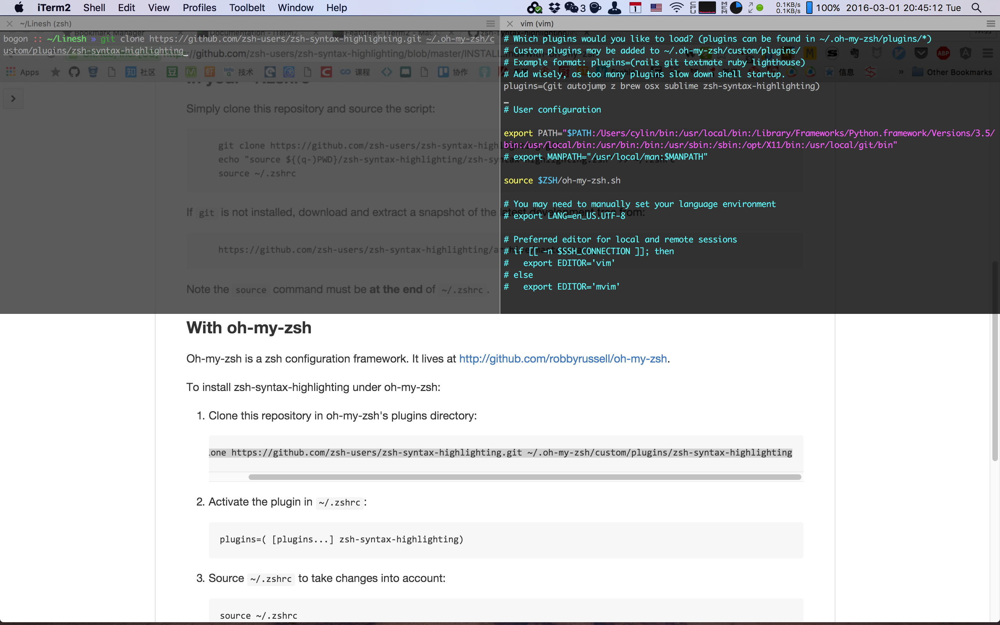

# iTerm2实用特性 Handy Features

这里的参考：[https://www.iterm2.com/features.html](https://www.iterm2.com/features.html)

iTerm这个终端具有比系统默认终端更强的能力，而term3则是最近刚发布的beta版本。它比起系统默认终端具备更加丰富且实用的功能，比如：
* 窗口切分(Split Panes)
* 即时窗口(Hotkey Window)
* 搜索，支持正则表达式
* 全键盘复制(Mouseless Copy)
* 自动补全(Auto Complete)
* 粘贴版历史记录(Paste History)
* 即时回放(Instant Replay)
* 触发器(Triggers)(虽然还不知道是什么鬼)
* ...等

## 窗口切分 Split Panes
iterm2支持把窗口进行横向纵向切分，自己可以调整占据的比例，并且不活跃的窗口（inactive panel）还会变暗以强调活跃的窗口，对于需要一个工作区间做多件事的需求是很有用的。

* 纵向切分：`Command+D`
* 横向切分：`Shift+Command+D`
* 窗口切换：`Command+[` / `Command+]` / `Option+Command+Left` / `Option+Command+Right`

## 即时窗口 Hotkey Window
hotkey windows让你在任何地方都可以打开终端执行一些命令，对我来说应用最多的场合，应该是在搜索一些问题的时候，对于一些需要输入命令的解决方案可以即时拷贝命令，打开终端来输入。比如，现在我在搜索“如何安装zsh语法高亮的插件”，然后找到了zsh语法高亮插件的官方github，一共有三个步骤，我可以立即就打开iterm2的hotkey window，拷贝git clone的命令拷贝仓库，再打开一个窗口用vim修改`~/.zshrc`文件的内容，然后`source`一下，高亮搞定！

* 全屏切换：`Command+Enter`。全屏模式切换在hotkey window下尤其顺滑，太赞！！

## 搜索与全键盘复制粘贴 Search and Mouseless Selection
这个功能其实我不太常用，就是可以在iterm2窗口中搜索内容，跟在编辑器中搜索一样，支持正则表达式搜索。此外，还支持选中当前搜索内容一键复制等，功能强大，就是没怎么用到。

* 搜索：`Command+F`
* 复制选中内容：`Enter/Return`
* 拓展选择（反向拓展）：`tab/Shift+tab`

## 自动补全与粘贴板历史 Autocomplete and Paste History
只要是在终端输入过的词或者命令，iterm2就可以帮你提供自动补全的建议，快捷键是`Command+;`，关于这个功能有许多替代品，比如autojump/z、`Control+R`搜索命令、`history`命令等，什么时候最适合使用这个功能，我觉得是在命令很长的时候，如下，但不可替代性并不是很强。

另外，iterm2也帮你保存了你输入过的命令，通过快捷键`Shift+Command+H`即可调出，调出后可通过键盘输入来筛选，可以做到纯键盘输入以前已经输过的长命令，快捷键也比`Control+R`友好一点，可视化程度更高一些。

## 即时回放 Instant Replay
逆天功能，可以回放过去任一__时刻__里iterm窗口的状态，在你需要之前窗口的一些信息时特别有用，可以回过去查看。虽然我不怎么用到这个功能，但你知道出事了随时都可以回去查看以前的信息。快捷键是`Option+Command+B`，每个session的即时回放缓存默认是4MB，可以在设置里面改

## 智能选择 Smart Selection
iterm2能够只能识别邮件地址、URL、文件名、文件夹等名称，按住`Command`键点击即可去到相应的地方。比较handy，用处不小也不大。

