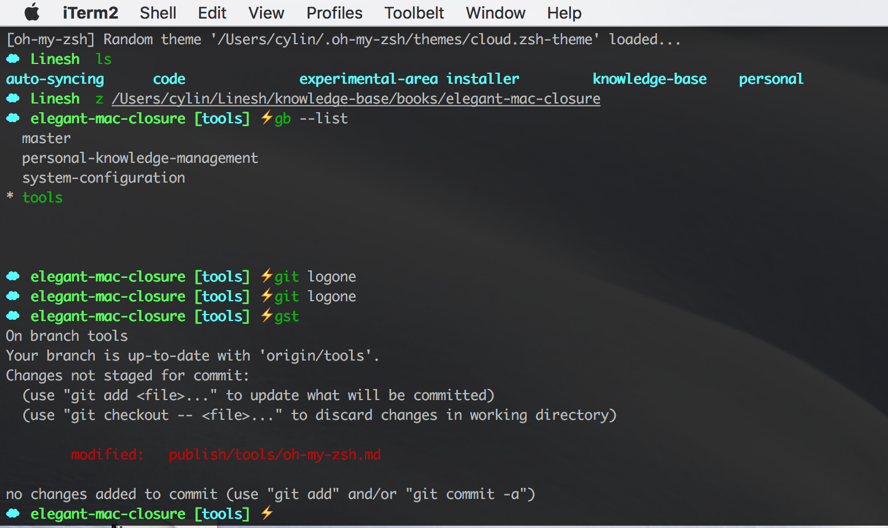
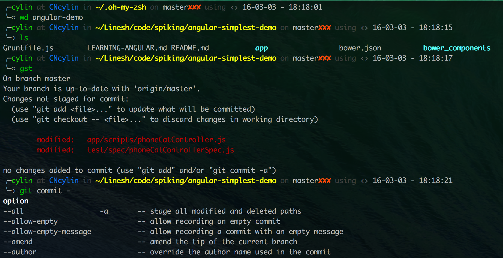
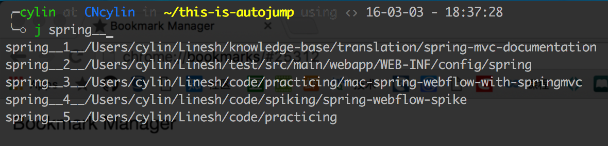
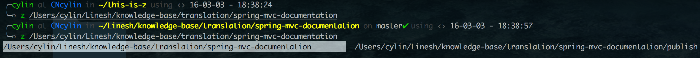
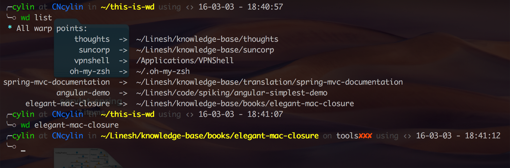
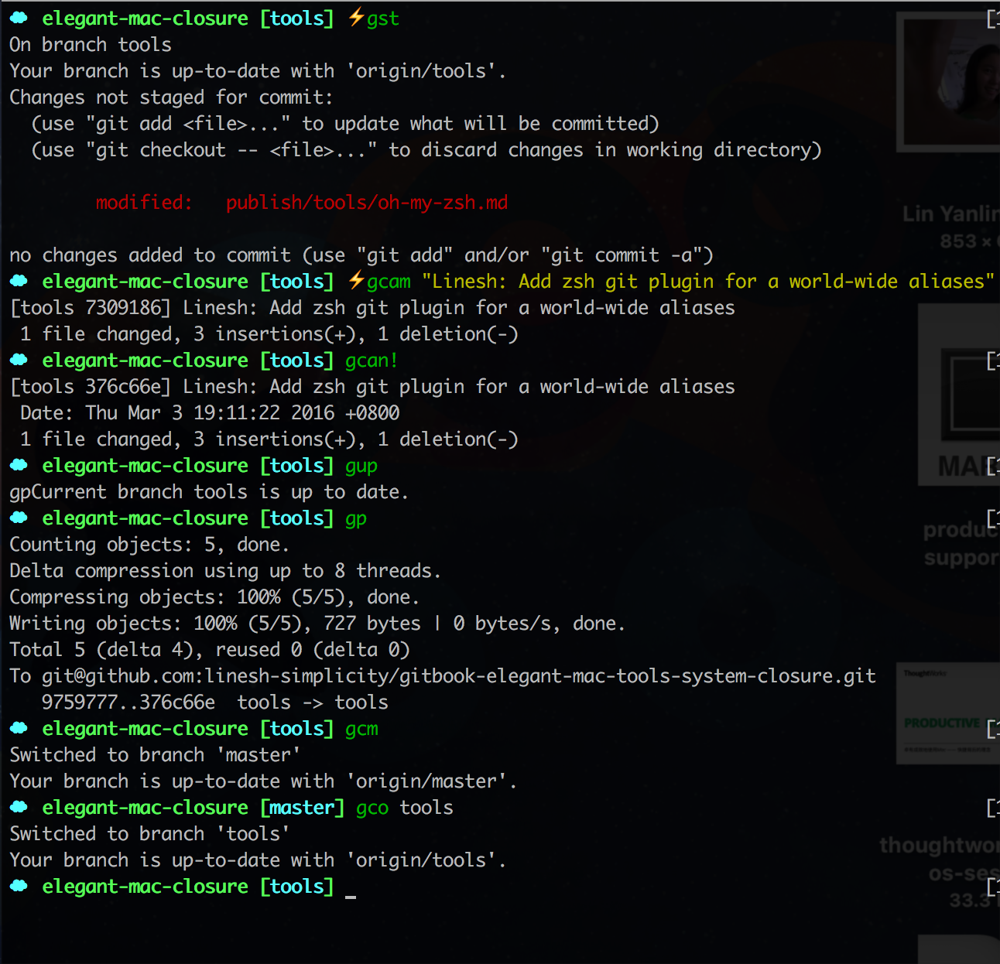

# oh-my-zsh

有了一个趁手的终端，大的功能就算有了，接下来是一些小的细节的优化，比如主题，自动补全，三方插件集成等。因为[oh-my-zsh](http://ohmyz.sh/)太过有名，为我节省了一些选择的时间，也就不需要再考察其他选择，用了再说。其主页的介绍也是相当不低调，说用上一个主题，马上就会被别人当成极客中的大神，过来围观问你这个主题这么漂亮是怎么配的。然后深藏功与名的你，马上就会在程序员中作为神话被广泛传颂。

oh-my-zsh的两大主要功能分别是：
* __主題（themes）__
* __插件（plugins）__

## 工作目录与配置文件
[首先需要安装一个zsh](https://github.com/robbyrussell/oh-my-zsh/wiki/Installing-ZSH)，安装方法在此不详述请点击链接或查看官网。安装时需要提前装好`git`、`wget`或`curl`工具。

zsh默认的安装位置是在`~/.oh-my-zsh`文件夹下，同时在你的根目录`~`下会有一个配置文件`~/.zshrc`，这个配置文件非常重要，我们的主题和插件都是在这个文件里面配。同时它做好一些准备工作后，会去调用`~/.oh-my-zsh/oh-my-zsh.sh`文件设置好启动zsh所需的所有路径、加载完主题和插件。这个脚本源码值得阅读，官方文档中提到的许多特性都在这个脚本中体现，比如定制自己的配置、主题和插件等时的目录约定、定制主题优先于默认主题的加载、空/随机主题的配置和加载、自动更新等。配置好`~/.zshrc`文件后，`source ~/.zshrc`一下即生效。


## 主题 Themes
所有的主题都在`~/.zshrc`脚本的`ZSH_THEME`一行中配置，个人喜好是使用`"random"`值，每次zsh启动时都会随机加载一个主题。所有的官方标配主题都放在`~/.oh-my-zsh/themes`文件夹中，也可以[前往官方wiki之主题篇查看效果](https://github.com/robbyrussell/oh-my-zsh/wiki/themes)。另外目前官方已不接受更多的主题提交请求，所以用户自己定制的一些主题则要前往[External Resource](https://github.com/robbyrussell/oh-my-zsh/wiki/External-themes)查看。






## 插件 Plugins
就我所了解，zsh的插件并不提供实质性的功能，比如`git`插件，并不会自带git的命令行工具。插件提供的更多的是__集成__和__alias__的功能，只是为了让你在终端能更好更快地使用它。当然也有一些提供了便捷功能的插件，比如目录自动跳转等。

插件开启在`~/.zshrc`文件的`plugins=(git ...)`一行配置，加入插件名并以空格分隔即可。所有的插件都已经放置在`~/.oh-my-zsh/plugins`目录下了。下面推荐一些个人比较推荐的插件，更多的插件可以在[github的官方wiki](https://github.com/robbyrussell/oh-my-zsh/wiki/Plugins-Overview)查询。

```sh 
zsh-syntax-highlighting zsh-history-substring-search
```

### 自动跳转 Fast Jumping 
* `autojump`。没有结果预览，不太友好
* `z`。UI非常友好，并且有多个结果时支持使用TAB键进行导航特点是刚开始用要先进去你的目录让它“学习”
* `wd`。可以给特定的目录“注册”（`wd add name`）别名，然后直接输入别名即可进入目录，特点是只能跳转到已注册的目录。但支持键盘操作，属于…可有可无的插件

目前题主我三个工具都启用了，但打算关闭autojump，因为觉得z的UI更加友好








### 更简短的快捷键 Alias
* `git`。首推git插件，它提供的是一个__全球统一__的alias，只要是使用zsh的终端都可以使用同样的缩略命令，常用的有比如`gst` `gca` `gca!` `gcan!` `gup` `gp` `gcb` `gcf` `gcm` `gco`等，完整的命令列表可以参考[`zsh-git`github的官方wiki](https://github.com/robbyrussell/oh-my-zsh/wiki/Plugin:git)
  
* `sublime`。使用统一的`st`命令启动sublime，为你屏蔽了sublime可能混乱的安装位置
* `history`。提供了`h`代替`history`，提供了`hsi`命令来搜索带特定字符串的历史

* vim的语法高亮
* git-completion git命令的自动补全
* zsh-completion zsh命令的自动补全
* zsh-syntax-highlighting 简直美妙